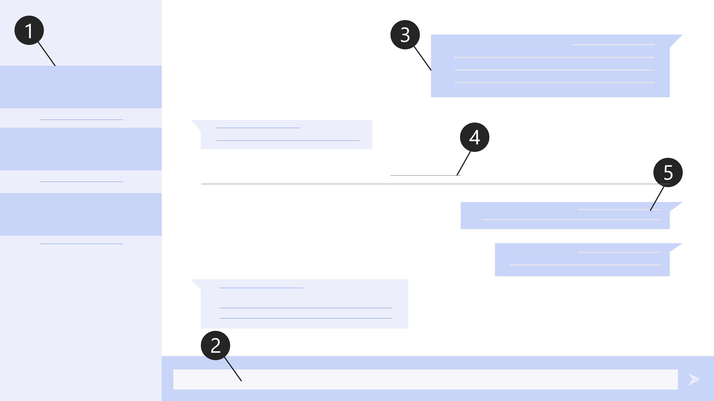

# Research and Wireframes

This file will contain research and initial wireframes for the chat room application which I will be creating with NodeJS and Socket.io

# Chatroom Essentials (front end functionality)

Features which would prove essential to the user on the front end aspect of the application.

1. Available chatrooms to join.
2. Input field to type messages in, and send to recipients.
3. History of each chatrooom/chat needs to show up when entering the chatroom.
4. Dates and times of when the chats took place.
5. Visable usernames for all who talk in the chat.

# Initial Wireframe

This wireframe contains annotations which link up with the above list of essential features.

